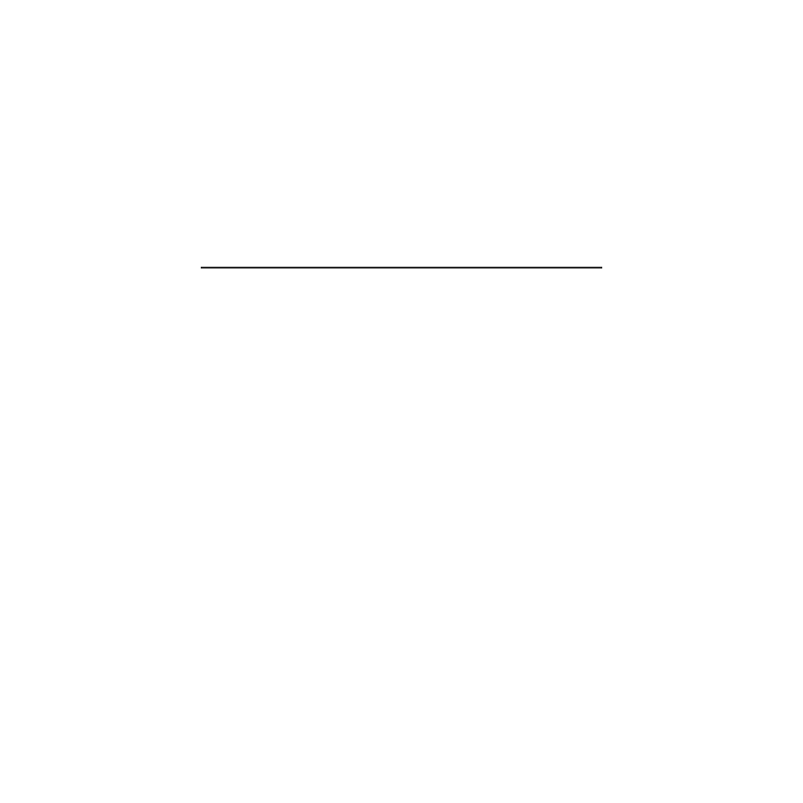
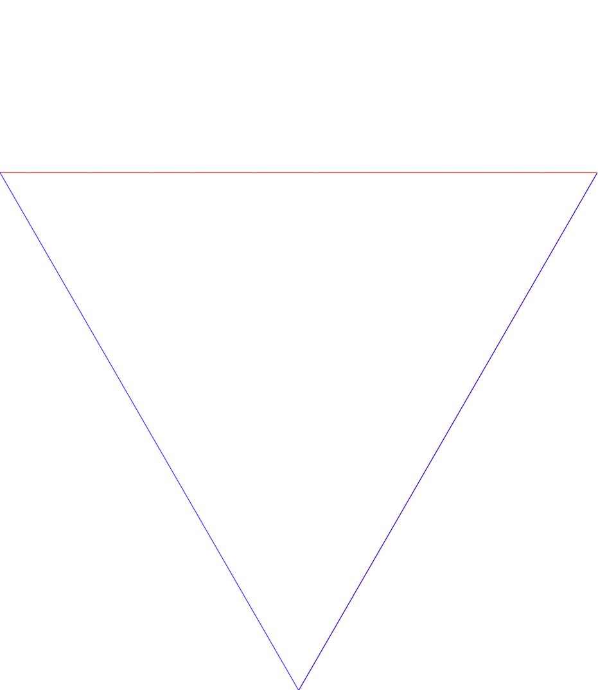

# Calcul, en programmation distribuée, de figures fractales en utilisant la bibliothèque Cairo.

Réalisation, en C, du Dragon de Levy et du Flocon de Koch en programmation séquentielle puis distribuée via OpenMPI et Cairo.

Attention : Par défaut, le hostfile ne contient que le localhost. 

## Exemples des deux fractales réalisées :

## Algorithmes :

Des explications plus détaillées ainsi que les études de complexité sont disponibles dans un fichier pdf.

### Dragon de Levy :

Pour réaliser cette figure, on utilise le L-système suivant : 

Alphabet : { F, +, - } | Axiome de départ : F | Règle : F → + F - - F +

● n = 0 → F  
● n = 1 → +F--F+  
● n = 2 → ++F--F+--+F--F++  
● n = 3 → +++F--F+--+F--F++--++F--F+--+F--F+++  

La suite finale de symboles est la liste d'instructions à exécuter pour le tracé de la figure.  
('+' et '-' = droite et gauche, 'F' = avancer)

La plupart des fractales peuvent être réalisées via un L-système, cette méthode peut donc facilement être appliquée pour réaliser d'autres figures en programmation distribuée.

### Flocon de Koch :

L'algorithme conçu permet à un processus de lire la suite d’angles de la figure à tracer. On utilise pour çela uniquement un tableau de taille du nombre d’itérations, disponible en O(1), sans aucun calcul. On fera ensuite uniquement des incrémentations/décrémentations dans le tableau.
Cet algorithme évite tout calcul, cependant, on ne peut s’affranchit de tracer 4^{n} segments, avec n la profondeur d’itération.